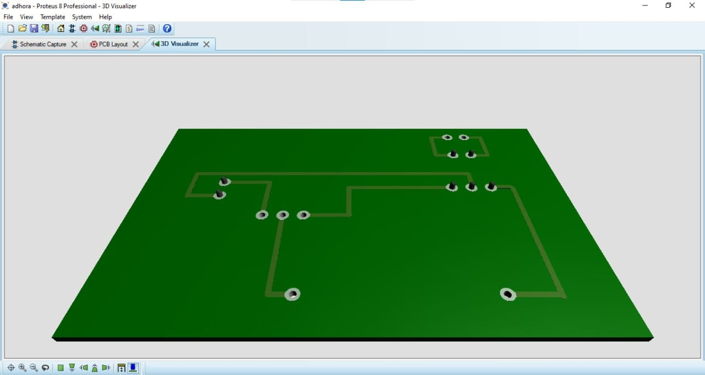
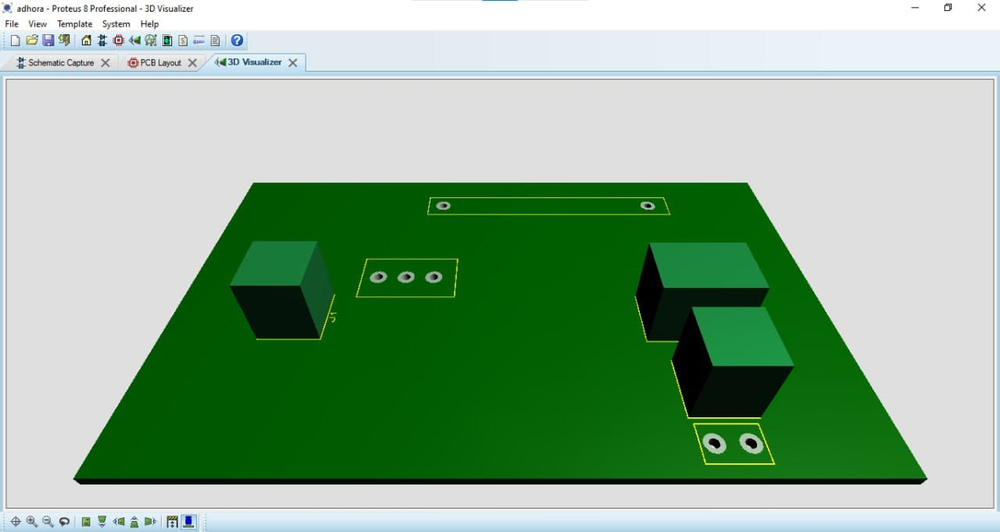
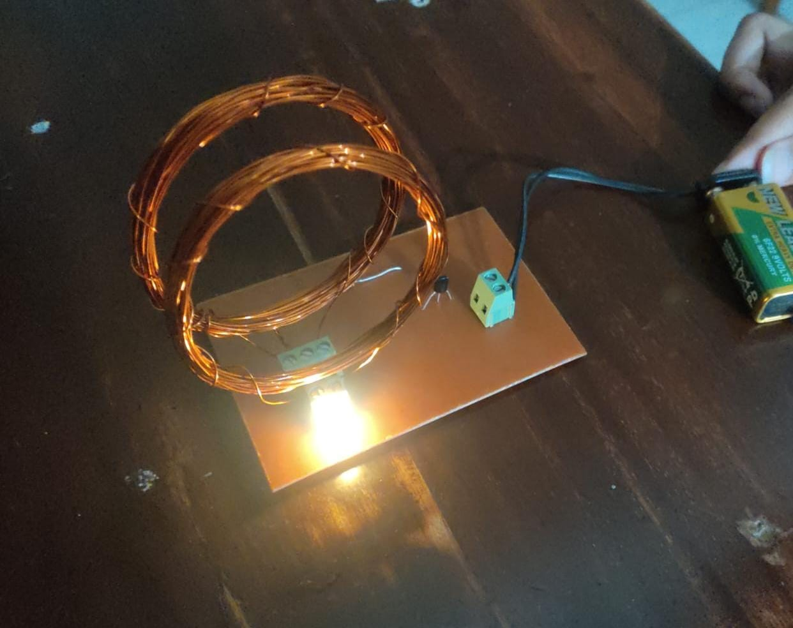
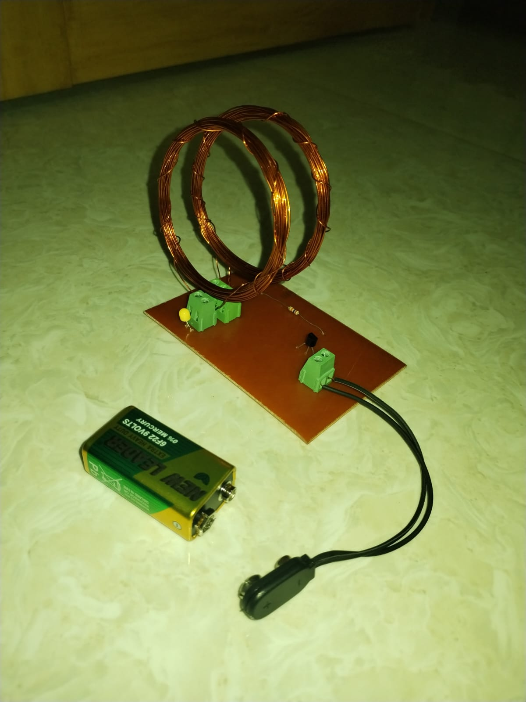
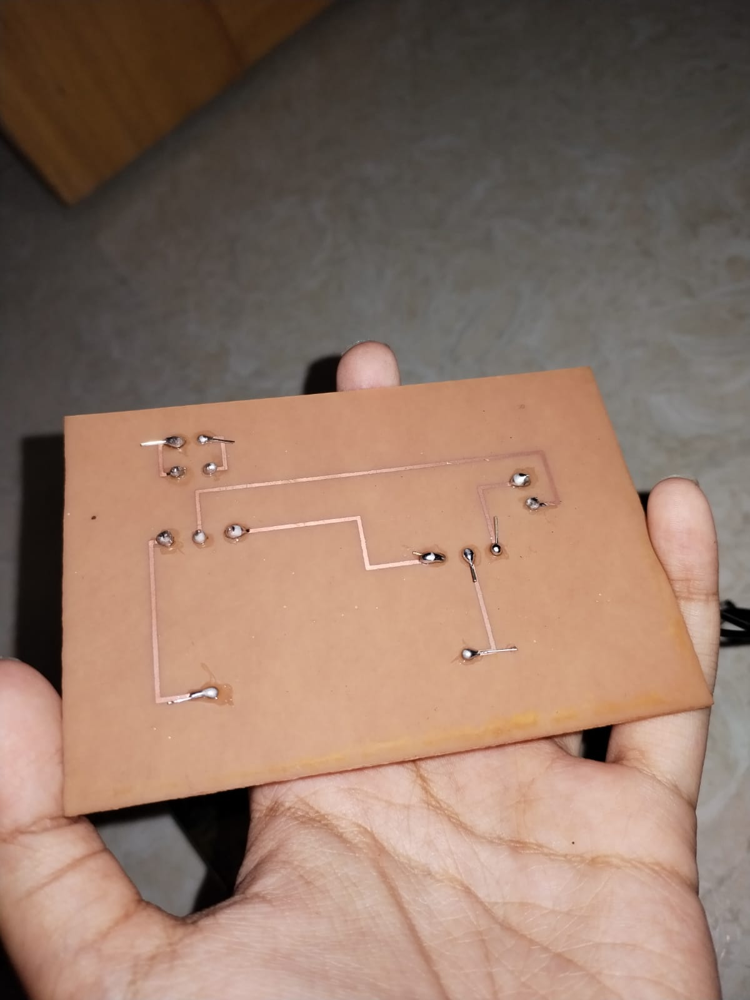
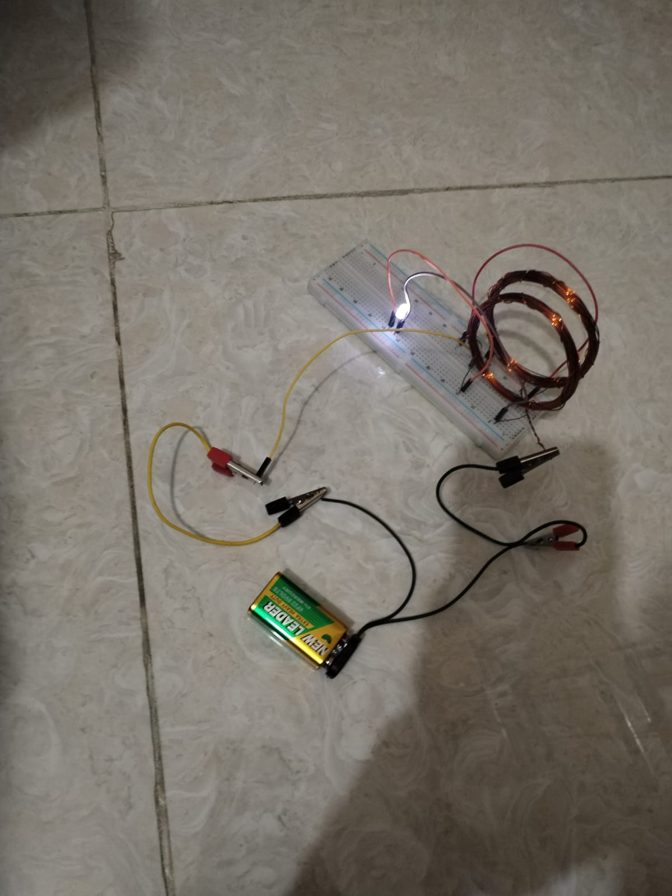

# Wireless_Power_Transmission
# Wireless Power Transfer System

**Team Members**: Faria Anowara Adhora, Adrija Nandy, Samia Yeasmin  
**Department of EEE, CUET**

## Project Overview

This project demonstrates a basic **Wireless Power Transfer (WPT)** system that uses inductive coupling to wirelessly transfer power to an LED. The system utilizes a transmitter coil that generates a high-frequency magnetic field, which is captured by a receiver coil and converted back into electrical power. This concept has significant applications in mobile charging, electric vehicles, and medical devices.

## Key Components:
- **Transmitter Coil**
- **Receiver Coil**
- **LED**
- **Transistor**
- **Resistors**
- **PCB**

For full project details, please refer to the PDF in the repository.

**Figure 1**: 3d visualization of the pcb(bottom side)

**Figure 2**: 3d visualization of the pcb(upper side)

**Figure 3**: Circuit Diagram

**Figure 4**: Practical Working of the Project

**Figure 5**: Clear Picture of soldered components

**Figure 6**: Showcase of the soldering

**Figure 7**: Testing the circuit with breadboard before making the pcb layout

